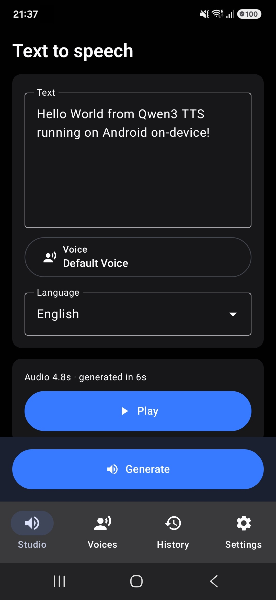
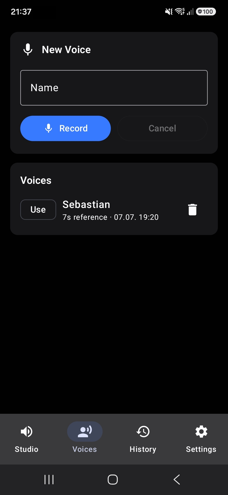
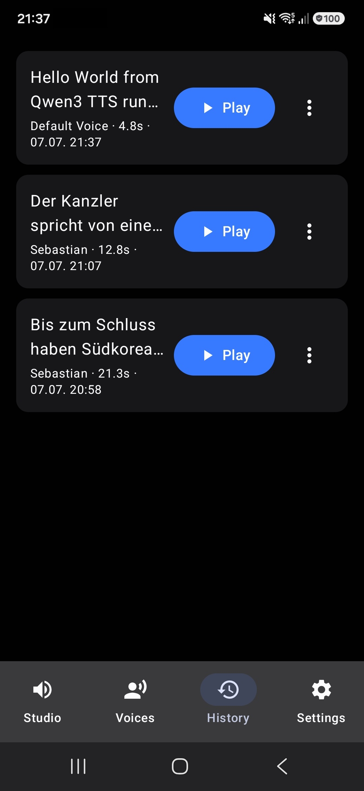
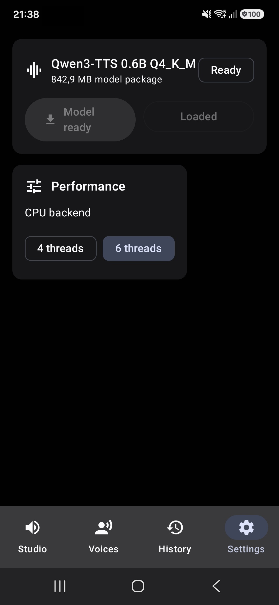

# Qwen3 TTS Android

Android app for local, on-device text-to-speech with Qwen3-TTS and
`qwen3-tts.cpp`.

Qwen3 TTS Android runs the speech model on the device, stores generated audio
locally, and provides a compact workflow for creating voice profiles from
microphone recordings.

## Screenshots

| Studio | Voices |
| --- | --- |
|  |  |

| History | Settings |
| --- | --- |
|  |  |

## Features

- On-device Qwen3-TTS synthesis through the `qwen3-tts.cpp` native runtime
- Jetpack Compose UI with Studio, Voices, History, and Settings screens
- Q4_K_M model download and loading from app-private storage
- Voice profiles with microphone recording and speaker embedding extraction
- Local generation history with playback, stop, delete, and WAV export
- CPU runtime path for Android devices
- Progress output with elapsed time, estimated audio length, and history-based ETA
- Android launcher icon shared with Qwen TTS Studio

## Model

The app uses this model package:

- `qwen-tokenizer-12hz-Q4_K_M.gguf`
- `qwen-talker-0.6b-base-Q4_K_M.gguf`

Model files are downloaded from
[`Serveurperso/Qwen3-TTS-GGUF`](https://huggingface.co/Serveurperso/Qwen3-TTS-GGUF)
into the app-private files directory.

## Requirements

- Android Studio or a local Android SDK installation
- Android NDK through the SDK manager
- JDK 17
- An arm64 Android device, Android 12 / API 31 or newer

The native build targets `arm64-v8a`.

## Build

Initialize submodules:

```powershell
git submodule update --init --recursive
```

Build a debug APK:

```powershell
.\gradlew.bat :app:assembleDebug
```

Build a release APK:

```powershell
.\gradlew.bat :app:assembleRelease
```

APK outputs:

```text
app/build/outputs/apk/debug/app-debug.apk
app/build/outputs/apk/release/app-release.apk
```

## Install On A Device

With a device connected through ADB:

```powershell
adb install -r app\build\outputs\apk\release\app-release.apk
```

On first launch, open Settings and download the Q4_K_M model package.

## Repository Layout

```text
app/                         Android app, Compose UI, JNI wrapper
app/src/main/cpp/            Android CMake integration
app/src/main/java/.../data   Recorder and Room database
external/qwen3-tts.cpp       Native Qwen3-TTS runtime submodule
```

## License

This project is licensed under the MIT License. See [LICENSE](LICENSE).
